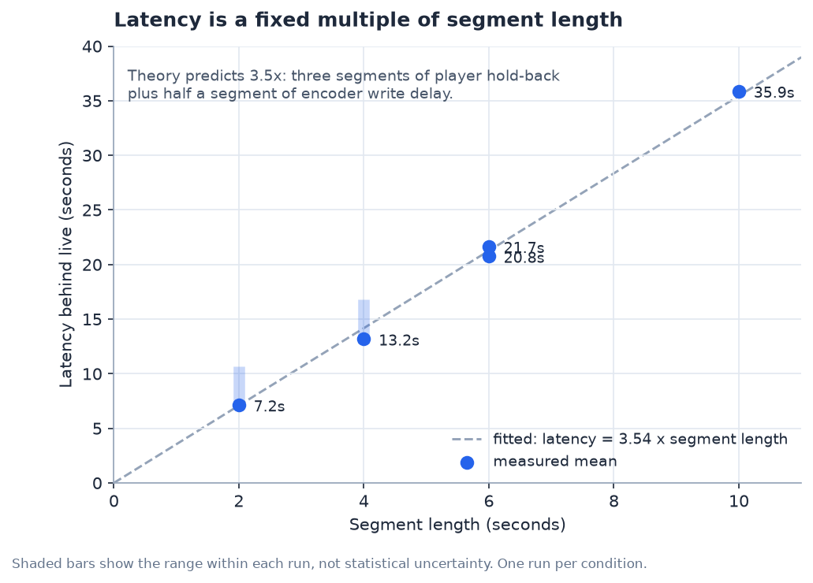
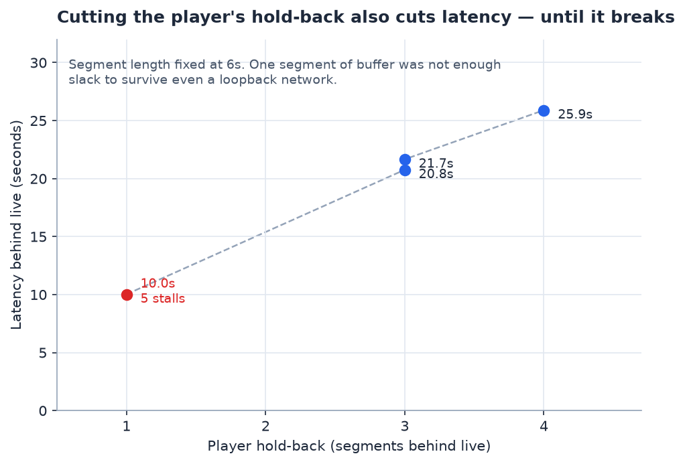
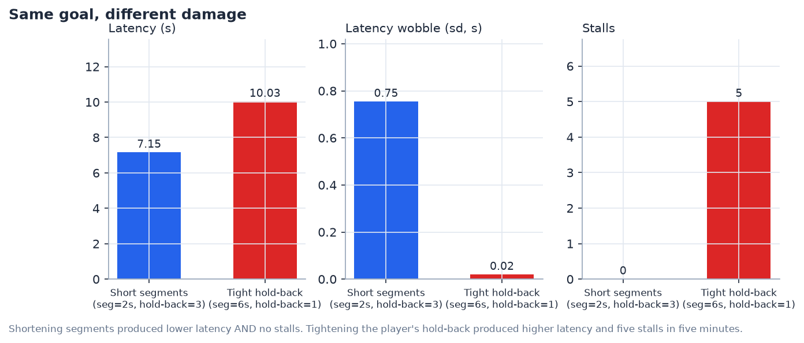
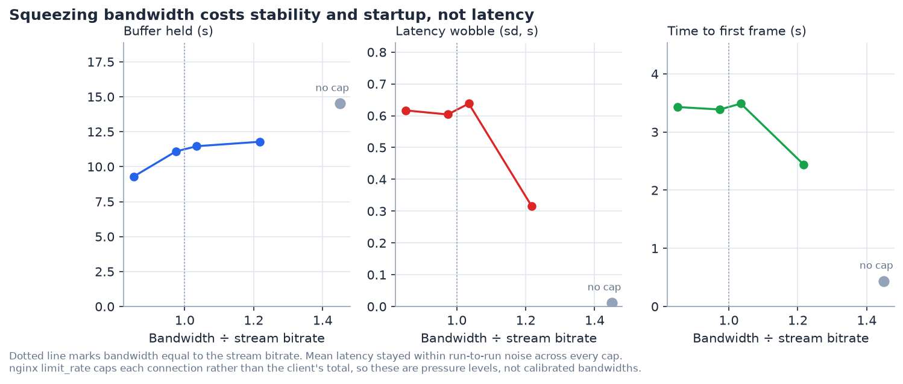
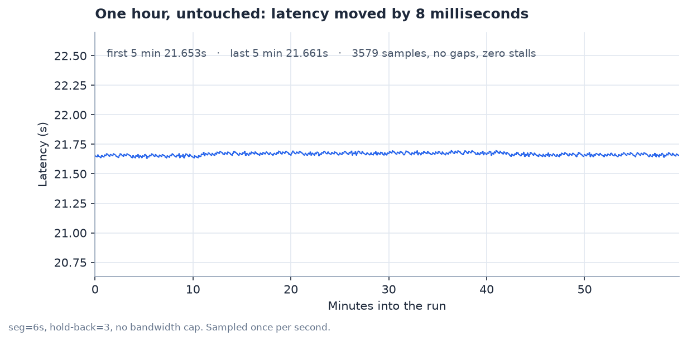
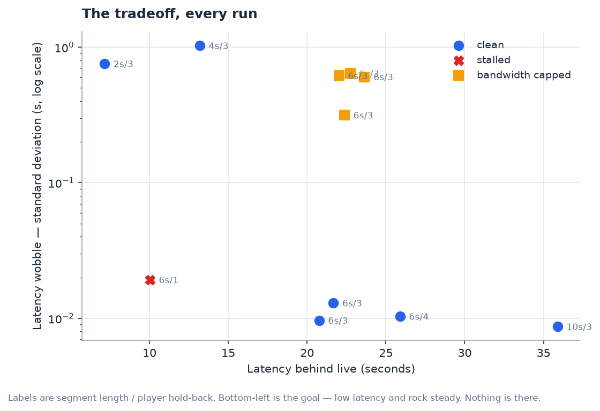

# What makes a live stream delayed

I built a TV channel that runs itself, then spent a while trying to work out
where the delay between "it happened" and "I can see it", called *latency*, actually comes from.
This is what I found across fourteen runs and about 8,400 measurements, all on
my personal computer computer.

## How I measured it

One FFmpeg process reads a playlist and never stops. It stamps the wall clock
onto every frame, encodes once, and sends the result out two ways at the same
time: as HLS segments on disk, and as a continuous SRT stream. nginx serves the
segments, a browser page plays them back, and once a second that page works out
how far behind real time the picture is.

The trick that makes this possible is a tag called `PROGRAM-DATE-TIME` that
sits in every HLS manifest. It says what wall-clock moment the video started.
The player knows how far into the video it currently is, so subtracting one
from the other gives you the timestamp of the frame on screen. Compare that
against the actual clock and you have your latency, with no stopwatch and no
second camera pointed at the screen.

Every reading goes into Postgres along with the settings it was taken under, so
I can compare any two runs later without needing to trust my memory.

The channel itself runs at 30 frames a second with a keyframe every 2 seconds,
2500 kbps of video plus 128 kbps of audio, so roughly 2.6 Mbps in total. I
varied three things:

| | What it controls | Set by |
|---|---|---|
| Segment length | How many seconds of video go into each file | The encoder |
| Player hold-back | How far behind the newest segment the player deliberately sits | The browser |
| Bandwidth | An artificial cap on how fast segments can be fetched | The web server |

Each run starts the channel, waits for the manifest to fill up, opens a
browser, records for a set number of minutes and then shuts everything down.
It's all one command, so every run is identical apart from the one thing I'm
changing.

## Segment length sets almost everything



I tried segment lengths of 2, 4, 6 and 10 seconds with everything else held
still, and the result came out almost perfectly straight:

```
latency ≈ 3.54 × segment length
```

What I like about that number is that it isn't arbitrary. It breaks down into
two pieces I could point at. The player deliberately stays three segments
behind the newest one so it has something in hand if a download runs slow,
which is 3 segments. And a segment can't be published until it's finished, so
on average the newest video available is half a segment old. Three and a half,
and I measured 3.54.

The practical version is that segment length multiplies everything rather than
adding to it. Halving it halves the latency. Going from 10-second segments to
2-second ones took me from 36 seconds behind live down to 7, which is a bigger
effect than anything else I tried.

## HLS vs SRT

So when people say HLS is slow, this is why, and it isn't the internet's
fault. HLS chops video into files, and a file can't be sent until it's
complete. The delay is designed in. My second output is the same encoder
pushing an SRT stream that does neither of those things, no chopping and no
hold-back, and watching the two side by side the gap is hard to miss: roughly
2 seconds against 20. I never recorded SRT into the database the way I
did with HLS, so that's my observation rather than a strict measurement. 

## The player has its own dial



Segment length is set by the encoder, so I wondered how much I could do from
the other end. Keeping segments at 6 seconds and changing only how far behind
the player sits moved latency nearly as much: 10 seconds at one segment of
hold-back, 26 seconds at four.

That's worth knowing because it's a browser setting. No re-encoding, no server
change, nothing to redeploy. If you have a stream you can't touch,
this is the config you can still tweak.

But the run at one segment of hold-back stalled five times in five minutes,
which sent me down a more interesting path.

## Same latency, different damage



Both of these land at roughly ten seconds behind live:

| | Latency | Wobble | Stalls |
|---|---|---|---|
| Short segments (2s, hold-back 3) | **7.15s** | 0.75s | **0** |
| Tight hold-back (6s, hold-back 1) | 10.03s | 0.02s | **5** |

Shortening segments gave me lower latency and never stalled once. Tightening
the player's hold-back gave higher latency and five interruptions. So on the
face of it, shorter segments win.

Except they fail in opposite ways, and I don't think either is simply better.
Short segments keep a healthy buffer so playback never breaks, but the latency
wanders around by several seconds. A tight hold-back holds latency to a
hundredth of a second right up until the buffer runs dry and the picture
freezes. One is unsteady but unbreakable, the other is precise but brittle.

## The wobble turned out to be the player, not the stream

The obvious follow-up was why short segments wobble at all. Latency at 2 and 4
second segments moves around by three or four seconds, while at 6 and 10 it's
flat to a hundredth of a second. The answer was already sitting in the data,
because I'd been logging the player's playback speed with every reading.

Modern players don't jump when they fall behind. They play about 5% fast until
they've caught up, on the grounds that speeding up slightly is less annoying
than skipping.

| Segment length | Readings taken while playing fast |
|---|---|
| 2 seconds | **13.4%** |
| 4 seconds | **13.7%** |
| 6 seconds | 0% |
| 10 seconds | 0% |

At short segments the player spends one reading in seven catching up. At long
ones it never falls behind at all.

The reason is that the target window scales with segment length. Three
2-second segments is a six-second window, while three 6-second segments is
eighteen. Ordinary timing jitter of half a second is a tenth of the small
window and a thirtieth of the big one, so the same wobble only crosses the line
where the player decides to catch-up in the short-segment case.

So the instability I was seeing isn't the stream being unreliable at all. It's
the player continuously correcting itself, and the correction showing up as
movement in the latency.

## Squeezing bandwidth costs stability and startup, not latency



Next I capped how fast the server would hand over segments, from 22% more
bandwidth than the stream needs down to 15% less, and watched three things
happen.

The buffer shrank steadily, from 14.5 seconds with no cap down to 9.3 seconds
at the tightest setting. That's a clean, orderly decline and exactly what we can
expect from a player with less room to work in.

Stability fell apart. Latency wobble went from 0.01 seconds to about 0.6, and
time spent catching up went from never to one reading in five.

Startup got much worse: 0.45 seconds to the first frame with no cap, against
2.4 to 3.5 seconds with one. That's five to eight times slower, and the biggest
single effect I measured anywhere in the project.

What didn't move was the average latency. Every capped run landed between 22.0
and 23.6 seconds, which is inside the run-to-run variation I describe further
down. So less bandwidth doesn't push us further behind live. It makes the
stream take much longer to start, and much less steady once it has.

## An hour, untouched playback, and nothing moved



Last, I left the channel running for an hour without touching it, sampling once
a second.

```
first five minutes   21.653 s
last five minutes    21.661 s
difference           8 milliseconds
```

Across 3,579 readings there were no stalls, three dropped frames out of roughly
108,000, and not a single gap in the sampling. The trend line through the whole
hour is indistinguishable from flat.

This is the one the rest of my project relies on. Other experiments compare one
setting against another, but this one confirms everything works.

## The tradeoff, all together



Here's every run at once, positioned by how far behind live it sat and how
steady it stayed once it got there.

The bottom-left corner, low latency and rock steady, is empty. Nothing I
configured landed there. Every route toward lower latency moved a run up the
chart into more wobble, or off it entirely into stalling. That's the tradeoff I
went looking for, and it held in every direction I pushed.

## Additional findings

Startup time turned out to be independent of segment length. It sat between
434 and 544 milliseconds across all four, so about half a second regardless of
how the encoder was configured. The one thing that did move it was bandwidth,
where it jumped to over three seconds.

Frame drops stayed negligible almost everywhere. The unthrottled runs dropped
0, 2, 2, 3 and 6 frames out of tens of thousands, which is small enough that
comparing them isn't worth much. The one run that stood out was the tight
hold-back at fifteen frames, alongside its five stalls. Under bandwidth
pressure drops rose to around 1%, though only in three of the four capped runs.

The bandwidth cap also never quite pushed the player over the edge. Even 15%
below what the stream needs, it held a 9-second buffer and didn't stall. nginx
limits each connection rather than the browser's total and a browser opens
several at once, so what I was really varying was pressure rather than a
precise bandwidth. The trends are solid, the exact numbers on that axis less so.

## Running it yourself

The raw data is in [`data/`](../data), every run and every reading as CSV.

```bash
./scripts/experiment.sh --seg 6 --sync 3 --minutes 10
.venv/bin/python app/chart.py
```

The first command runs one condition start to finish and prints a summary. The
second reads the database and redraws every figure in this document.
